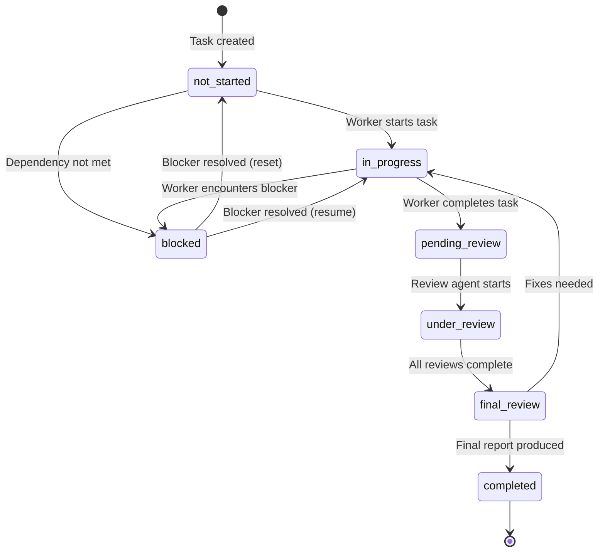

# Task State Machine

## Overview

Tasks in the multi-agent orchestration system follow a defined state machine to ensure predictable and trackable progress.

## States

| State | Description |
|-------|-------------|
| `not_started` | Initial state for all newly created tasks |
| `in_progress` | Worker agent is actively executing the task |
| `pending_review` | Task completed, awaiting review assignment |
| `under_review` | Review agent(s) actively auditing the task |
| `final_review` | All reviews complete, awaiting final report |
| `completed` | Final report produced, task is done |
| `blocked` | Task cannot proceed due to blocker |

## State Diagram



## Valid Transitions

| From | To | Trigger |
|------|-----|---------|
| `not_started` | `in_progress` | Worker starts task |
| `not_started` | `blocked` | Dependency not satisfied |
| `in_progress` | `pending_review` | Worker completes task |
| `in_progress` | `blocked` | Worker encounters blocker |
| `blocked` | `not_started` | Blocker resolved (reset) |
| `blocked` | `in_progress` | Blocker resolved (resume) |
| `pending_review` | `under_review` | Review agent starts auditing |
| `under_review` | `final_review` | All required reviews submitted |
| `final_review` | `completed` | Final report produced |
| `final_review` | `in_progress` | Fixes needed based on review |

## Invalid Transitions

The following transitions are **rejected** by the state validator:

- Skipping phases (e.g., `pending_review` → `completed`)
- Going backwards (e.g., `completed` → `under_review`)
- Any transition not in the valid transitions table

## Criticality Levels

Task criticality affects the review process:

| Level | Review Requirement |
|-------|-------------------|
| `standard` | Exactly 1 Review Agent |
| `complex` | ≥2 Review Agents in parallel |
| `security-sensitive` | ≥2 Review Agents with security focus |

## Implementation

State transitions are validated by `state_validation.go` in `codeagent-wrapper/internal/wrapper/`:

```go
var ValidTransitions = map[string][]string{
    "not_started":     {"in_progress", "blocked"},
    "in_progress":     {"pending_review", "blocked"},
    "blocked":         {"in_progress", "not_started"},
    "pending_review":  {"under_review"},
    "under_review":    {"final_review"},
    "final_review":    {"completed", "in_progress"},
    "completed":       {},
}
```

## Error Handling

When an invalid transition is attempted:

1. The transition is rejected
2. An error is logged with details
3. The task status remains unchanged
4. The caller receives an error response
